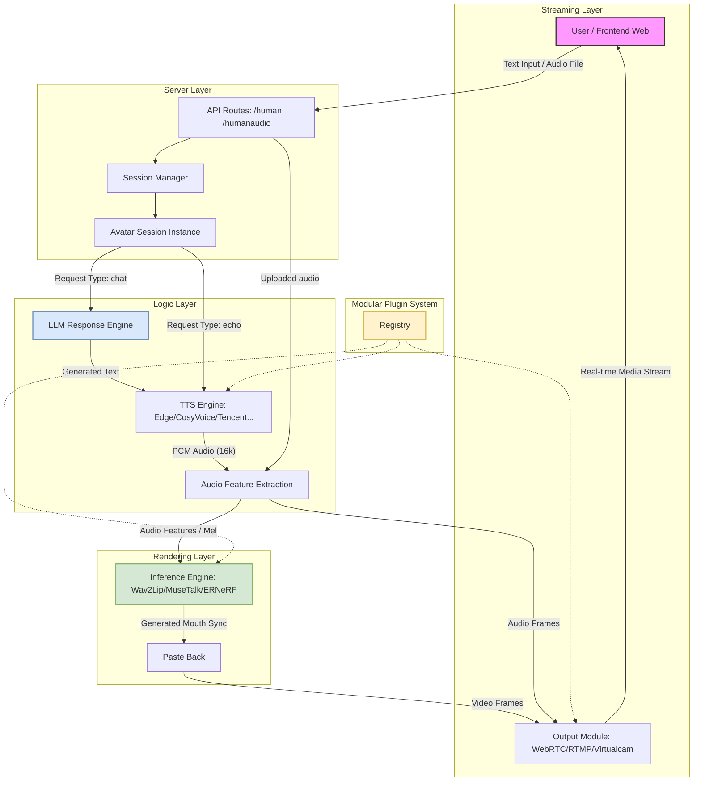

# English | [中文版](./README.md)  
 <p align="center">
 
<p align="center">
<p align="center">
    <a href="./LICENSE"></a>
    <a href="https://github.com/lipku/LiveTalking/releases"></a>
    <a href=""></a>
    <a href=""></a>
    <a href="https://github.com/lipku/LiveTalking/graphs/contributors"></a>
    <a href="https://github.com/lipku/LiveTalking/network/members"></a>
    <a href="https://github.com/lipku/LiveTalking/stargazers"></a>
</p>

A real-time interactive streaming digital human system enabling synchronized audio-video conversation, which basically meets commercial application standards.  
[wav2lip Demo](https://youtu.be/-ss0H8qLr7E) | [ernerf Demo](https://www.bilibili.com/video/BV1G1421z73r/) | [musetalk Demo](https://youtu.be/vzUMruoZlxc/)  
Domestic Mirror Repository: <https://gitee.com/lipku/LiveTalking> 


## Features
1. Supports multiple digital human models: ernerf, musetalk, wav2lip, Ultralight-Digital-Human.
2. Supports voice cloning.
3. Supports interrupting the digital human while it is speaking.
4. Supports full-body video stitching.
5. Supports WebRTC, rtmp, and virtual camera output.
6. Supports motion choreography: plays custom videos when the digital human is not speaking.
7. Supports custom digital human avatars.

## 1. Installation

Tested on Ubuntu 24.04, Python 3.10, PyTorch 2.5.0, and CUDA 12.4.

### 1.1 Install Dependencies

```bash
conda create -n nerfstream python=3.10
conda activate nerfstream
# If your CUDA version is not 12.4 (check via "nvidia-smi"), install the corresponding PyTorch version from <https://pytorch.org/get-started/previous-versions/>
conda install pytorch==2.5.0 torchvision==0.20.0 torchaudio==2.5.0 pytorch-cuda=12.4 -c pytorch -c nvidia
pip install -r requirements.txt
``` 
For common installation issues, refer to the [FAQ](https://livetalking-doc.readthedocs.io/en/latest/faq.html).  
For CUDA environment setup on Linux, refer to this article: <https://zhuanlan.zhihu.com/p/674972886>  
Troubleshooting for video connection issues: <https://mp.weixin.qq.com/s/MVUkxxhV2cgMMHalphr2cg>


## 2. Quick Start
- Download Models  
Quark Cloud Drive: <https://pan.quark.cn/s/83a750323ef0>    
Google Drive: <https://drive.google.com/drive/folders/1FOC_MD6wdogyyX_7V1d4NDIO7P9NlSAJ?usp=sharing>  
1. Copy `wav2lip256.pth` to the `models` directory of this project and rename it to `wav2lip.pth`.  
2. Extract the `wav2lip256_avatar1.tar.gz` archive and copy the entire extracted folder to `data/avatars` of this project.

- Run the Project  
Execute: `python app.py --transport webrtc --model wav2lip --avatar_id wav2lip256_avatar1`  
<font color=red>The server must open the following ports: TCP: 8010; UDP: 1-65536 </font>  

You can access the client in two ways:  
(1) Open `http://serverip:8010/webrtcapi.html` in a browser. First click "start" to play the digital human video; then enter any text in the input box and submit it. The digital human will broadcast the text.  
(2) Use the desktop client (download link: <https://pan.quark.cn/s/d7192d8ac19b>).  

- Quick Experience  
Visit <https://www.compshare.cn/images/4458094e-a43d-45fe-9b57-de79253befe4?referral_code=3XW3852OBmnD089hMMrtuU&ytag=GPU_GitHub_livetalking> and create an instance with this image to run the project successfully immediately.

If you cannot access Hugging Face, run the following command before starting the project:
```
export HF_ENDPOINT=https://hf-mirror.com
``` 

## 3. Architecture

### DataFlow Diagram
 

### System Architecture Diagram



### 1. API Layer
- **Endpoints**: 
    - `/human`: Accepts text for "echo" (direct playback) or "chat" (LLM interaction).
    - `/humanaudio`: Accepts raw audio files for playback.
- **Session Management**: Each connection is assigned a `sessionid` to maintain state and handle multiple concurrent users.

### 2. Logic Layer
- **LLM Engine**: Interfaces with models like Qwen to generate conversational responses.
- **TTS Engine**: A modular system supporting various providers (EdgeTTS, GPT-SoVITS, etc.) to convert text into speech.
- **Feature Extraction**: Extracts acoustic features (like Mel spectrograms) synchronously needed for visual lip-sync.

### 3. Rendering Layer
- **Model Inference**: Uses deep learning models (e.g., Wav2Lip, MuseTalk) to generate lip-synced video frames based on audio features.
- **Post-Processing**: Smoothly overlays the generated mouth area back onto the original high-quality avatar video.

### 4. Streaming Layer
- **Transports**: 
    - **WebRTC**: Low-latency browser-based streaming.
    - **RTMP**: Standard streaming protocol for platforms like YouTube/Bilibili.
    - **Virtual Camera**: Allows the output to be used as a system camera.

### 5. Plugin System
- **Registry**: Uses a decentralized registration mechanism ([registry.py](./registry.py)) allowing developers to add new TTS, Avatar, or Output modules easily. We welcome the integration of higher-performance models and services, and are also open to commercial cooperation. 

## 4. More Usage
For detailed usage instructions: <https://livetalking-doc.readthedocs.io/>
  
## 5. Docker Run  
No prior installation is required; run directly with Docker:
```
docker run --gpus all -it --network=host --rm registry.cn-zhangjiakou.aliyuncs.com/codewithgpu3/lipku-livetalking:toza2irpHZ
```
The code is located in `/root/livetalking`. First run `git pull` to fetch the latest code, then execute commands as described in Sections 2 and 3.

The following images are available:
- AutoDL Image: <https://www.codewithgpu.com/i/lipku/livetalking/base>   
[AutoDL Tutorial](https://livetalking-doc.readthedocs.io/en/latest/autodl/README.html)
- UCloud Image: <https://www.compshare.cn/images/4458094e-a43d-45fe-9b57-de79253befe4?referral_code=3XW3852OBmnD089hMMrtuU&ytag=GPU_GitHub_livetalking>  
Supports opening any port; no additional SRS service deployment is required.  
[UCloud Tutorial](https://livetalking-doc.readthedocs.io/en/latest/ucloud/ucloud.html) 


## 6. Performance
- Performance mainly depends on CPU and GPU: Each video stream compression consumes CPU resources, and CPU performance is positively correlated with video resolution; each lip-sync inference depends on GPU performance.  
- The number of concurrent streams when the digital human is not speaking depends on CPU performance; the number of concurrent streams when multiple digital humans are speaking simultaneously depends on GPU performance.  
- In the backend logs, `inferfps` refers to the GPU inference frame rate, and `finalfps` refers to the final streaming frame rate. Both need to be above 25 fps to achieve real-time performance. If `inferfps` is above 25 but `finalfps` is below 25, it indicates insufficient CPU performance.  

- Real-Time Inference Performance  

| Model       | GPU Model  | FPS  |
| :---------- | :--------- | :--- |
| wav2lip256  | RTX 3060   | 60   |
| wav2lip256  | RTX 3080Ti | 120  |
| musetalk    | RTX 3080Ti | 42   |
| musetalk    | RTX 3090   | 45   |
| musetalk    | RTX 4090   | 72   | 

A GPU of RTX 3060 or higher is sufficient for wav2lip256, while musetalk requires an RTX 3080Ti or higher.

## 7. Commercial Version
The following extended features are available for users who are familiar with the open-source project and need to expand product capabilities:
1. High-definition wav2lip model.
2. Full voice interaction: supports interrupting the digital human’s response via a wake word or button to ask a new question.
3. Real-time synchronized subtitles: provides the frontend with events for the start and end of each sentence spoken by the digital human.
4. Provides a real-time audio stream input interface.
5. Transparent background for the digital human, supporting dynamic background overlay.
6. Real-time avatar switching.  
7. supporting multiple digital humans in the same scene.  
8. Camera‑driven digital human movements and facial expressions.  
9. Integrate with LiveKit.  

For more details: <https://livetalking-doc.readthedocs.io/en/latest/service.html>

## 8. Statement
Videos developed based on this project and published on platforms such as Bilibili, WeChat Channels, and Douyin must include the LiveTalking watermark and logo.

---
If this project is helpful to you, please give it a "Star". Contributions from developers interested in improving this project are also welcome.
* Knowledge Planet (for high-quality FAQs, best practices, and Q&A): https://t.zsxq.com/7NMyO  
* WeChat: wxwubug  
* Telegram: https://t.me/livetalking  
* Discord: https://discord.gg/n5jSPCT3Uf  
* Email: lipku@foxmail.com  
* WeChat Official Account: 数字人技术 (Digital Human Technology)    

