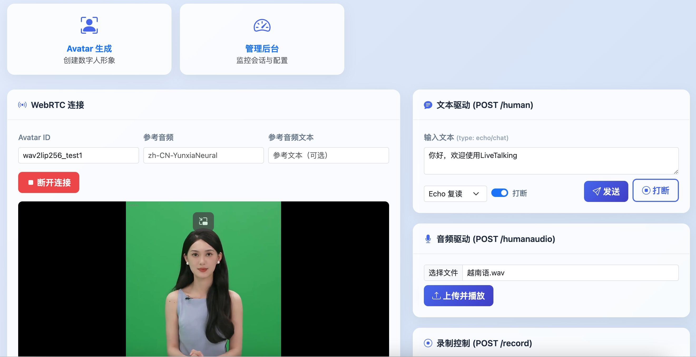

<p align="center">
    
</p>

English | [中文版](./README.md)

<p align="center">
    <a href="./LICENSE"></a>
    <a href="https://github.com/lipku/LiveTalking/releases"></a>
    <a href=""></a>
    <a href=""></a>
    <a href="https://github.com/lipku/LiveTalking/graphs/contributors"></a>
</p>
<p align="center">
<a href="https://trendshift.io/repositories/12565" target="_blank"></a>
</p>

A real-time interactive streaming digital human engine enabling synchronized audio-video conversation, widely adopted in commercial applications.

**Demos**: [wav2lip](https://youtu.be/-ss0H8qLr7E) | [ernerf](https://www.bilibili.com/video/BV1G1421z73r/) | [musetalk](https://youtu.be/vzUMruoZlxc/)

Domestic Mirror: [Gitee](https://gitee.com/lipku/LiveTalking) | [GitCode](https://gitcode.com/lipku/LiveTalking)

---

## Features
1. Supports multiple digital human models: ernerf, musetalk, wav2lip, Ultralight-Digital-Human
2. Supports voice cloning
3. Supports interrupting the digital human while speaking
4. Supports full-body video stitching
5. Supports WebRTC, RTMP, and virtual camera output
6. Supports action choreography: plays custom videos when not speaking
7. Supports multi-concurrency
8. Supports custom digital human avatars
9. Provides frontend API integration

---

## Usage Scenarios

LiveTalking leverages real-time streaming digital human technology to drive virtual avatars via text or voice, combined with LLM for intelligent conversation. Suitable for the following scenarios:

| Scenario | Description |
|----------|-------------|
| **Virtual Streamer / Live Commerce [LiveStream](https://github.com/lipku/livestream)** | 24/7 unmanned live streaming with LLM-generated sales scripts and action choreography for natural performance |
| **AI Digital Human Customer Service** | Integrate enterprise knowledge bases for real-time voice Q&A with interruption support |
| **Online Education / Training** | Digital teacher分身 for course recording, or API-driven digital instructor for real-time lectures |
| **Intelligent Voice Assistant** | Pair with smart speakers or apps, calling the `/human` API to drive digital human voice interactions |
| **Large Screen Presentation** | Digital human presenter for exhibition halls, event venues, and other content narration scenarios |
| **Batch Short Video Creation** | Submit scripts in batch via API to generate digital human videos without real-person filming, using `/human` + `/record` APIs |

**Core Flow**: User input (text/audio) → LLM response (optional) → TTS speech synthesis → Real-time lip-sync → Audio/video streaming output

---

## 1. Installation

Tested on Ubuntu 24.04, Python 3.12, PyTorch 2.9.1, CUDA 12.8.

### 1.1 Install Dependencies

```bash
git clone https://github.com/lipku/LiveTalking.git 
conda create -n livetalking python=3.12
conda activate livetalking
# If CUDA version is not 12.8 (check via nvidia-smi), install the corresponding PyTorch version(https://pytorch.org/get-started/previous-versions)
pip install torch==2.9.1 torchvision==0.24.1 torchaudio==2.9.1 --index-url https://download.pytorch.org/whl/cu128
cd LiveTalking
pip install -r requirements.txt
```

Installation FAQ: <https://doc.livetalking.ai/en/docs/faq/>

Linux CUDA environment setup: <https://zhuanlan.zhihu.com/p/674972886>

---

## 2. Quick Start

### 2.1 Download Models

| Source | Link |
|--------|------|
| Quark Cloud | <https://pan.quark.cn/s/83a750323ef0> |
| Google Drive | <https://drive.google.com/drive/folders/1FOC_MD6wdogyyX_7V1d4NDIO7P9NlSAJ?usp=sharing> |

1. Copy `wav2lip256.pth` to the project's `models/` directory and rename it to `wav2lip.pth`
2. Extract `wav2lip256_avatar1.tar.gz` and copy the entire extracted folder to `data/avatars/`

### 2.2 Start the Server

```bash
python app.py --transport webrtc --model wav2lip --avatar_id wav2lip256_avatar1
```

> **Note**: The server must open ports TCP:8010, UDP:1-65536

### 2.3 Client Access

| Method | Description |
|--------|-------------|
| Browser | Open `http://serverip:8010/index.html`, click "Start Connection" to play the digital human video, then enter text and submit |
| API | See [API Docs](docs/api.md) for HTTP-based integration |
| Desktop App | Download: <https://pan.quark.cn/s/d7192d8ac19b> |

### 2.4 Web Pages

| Page | URL | Description |
|------|-----|-------------|
| Home | `/index.html` | WebRTC connection + text/audio driver + recording control |
| Avatar Creator | `/avatar.html` | Upload video to auto-generate digital human avatars |
| Admin Console | `/admin.html` | Real-time session monitoring & global configuration |



### 2.5 Quick Experience

1. Create an instance with a cloud image to run instantly: [UCloud Image](https://www.compshare.cn/images/4458094e-a43d-45fe-9b57-de79253befe4?referral_code=3XW3852OBmnD089hMMrtuU&ytag=GPU_GitHub_livetalking)  
2. Windows Integrated Package <https://pan.quark.cn/s/a040bf5cb065>
3. Commercial Version Demo URL <https://www.livetalking.top>

### 2.6 Documentation
<https://doc.livetalking.ai/en>

---

## 3. Architecture

### Dataflow Diagram


### Layer Overview

**API Layer**
- `/human`: Accepts text, supporting echo (direct playback) and chat (LLM conversation) modes
- `/humanaudio`: Accepts audio files for direct playback
- Each connection is assigned a unique `sessionid`, supporting multi-user concurrency

**Logic Layer**
- **LLM Engine**: Integrates with models like Qwen to generate conversational responses (also accessible through OpenAI-compatible gateways such as [OrcaRouter](https://www.orcarouter.ai/ref/ref_ecb2e41965cb84fbc26d), via `--llm_provider orcarouter`)
- **TTS Engine**: Modular design supporting EdgeTTS, GPT-SoVITS, CosyVoice, Tencent Cloud, and more
- **Feature Extraction**: Synchronously extracts acoustic features (e.g., Mel spectrograms) for lip-sync inference

**Rendering Layer**
- **Model Inference**: Uses deep learning models (Wav2Lip, MuseTalk, etc.) to generate lip-sync frames from audio features
- **Post-Processing**: Smoothly overlays the generated mouth region back onto the original high-definition video

**Streaming Layer**
- **WebRTC**: Low-latency browser-based streaming
- **RTMP**: Standard live streaming protocol, supports pushing to platforms like Bilibili/YouTube
- **Virtual Camera**: Outputs as a system camera device

**Plugin System**
- Decentralized registration mechanism based on [registry.py](registry.py), allowing developers to extend TTS, Avatar, and Output modules

---

## 4. API Documentation

| Document | Description |
|----------|-------------|
| [docs/api.md](docs/api.md) | General API — WebRTC, text/audio driver, recording, action choreography |
| [docs/avatar_api.md](docs/avatar_api.md) | Avatar Generation API — create tasks, query progress, delete tasks |
| [docs/admin_api.md](docs/admin_api.md) | Admin API — global config, session monitoring, force stop |

---

## 5. Docker

Available images:
- **AutoDL**: [Image](https://www.codewithgpu.com/i/lipku/livetalking/base)  
- **UCloud**: [Image](https://www.compshare.cn/images/4458094e-a43d-45fe-9b57-de79253befe4?referral_code=3XW3852OBmnD089hMMrtuU&ytag=GPU_GitHub_livetalking) — Supports opening any port  


---

## 6. Performance

- Each video stream compression consumes CPU; higher resolution means greater CPU usage. Each lip-sync inference consumes GPU
- Concurrent sessions when not speaking depend on CPU; concurrent speaking sessions depend on GPU
- In backend logs: `inferfps` = GPU inference frame rate, `finalfps` = final streaming frame rate. Both must be >= 25 for real-time performance

### Real-Time Inference Performance

| Model | GPU | FPS |
|:------|:----|:----|
| wav2lip256 | RTX 3060 | 60 |
| wav2lip256 | RTX 3080Ti | 120 |
| musetalk | RTX 3080Ti | 42 |
| musetalk | RTX 3090 | 45 |
| musetalk | RTX 4090 | 72 |

- wav2lip256: RTX 3060 or higher recommended
- musetalk: RTX 3080Ti or higher recommended

---

## 7. Commercial
|dimension|Open Source Version|Commercial Version|
|---|---|---|
|Positioning|Open Source Community Edition, Apache 2\.0|Commercial paid version, targeted at customers requiring high performance and operable delivery|
|Core Objectives|Rapid prototyping, secondary development, and academic research|Out Of The Box commercial delivery: performance acceleration, Self\-Adaptation actions, real\-time interaction|
|Tech Stack|Three models: wav2lip, musetalk and ultralight|Added wav2lip and a full set of enhancement capabilities based on the open\-source version| 

More detail <https://doc.livetalking.ai/en/docs/service/>  

---
## 8. Statement

Videos developed based on this project and published on platforms such as Bilibili, WeChat Channels, and Douyin must include the LiveTalking watermark and logo.

---

## Citation

If this repository helps your research or project, please cite our work.

```
@software{livetalking,
  author = {Hengzhong Li},
  title = {LiveTalking: Real-Time Interactive Streaming Digital Human Framework},
  year = {2025},
  publisher = {GitHub},
  url = {https://github.com/lipku/livetalking}
}
```

---


| Community | Link |
|-----------|------|
| Knowledge Planet | <https://t.zsxq.com/7NMyO> |
| WeChat | wxwubug  |
| Telegram | <https://t.me/livetalking> |
| Discord | <https://discord.gg/n5jSPCT3Uf> |
| Email | lipku@foxmail.com |
| WeChat Official | 数字人技术 |


