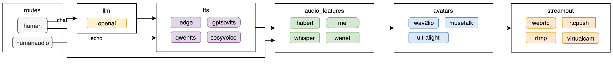
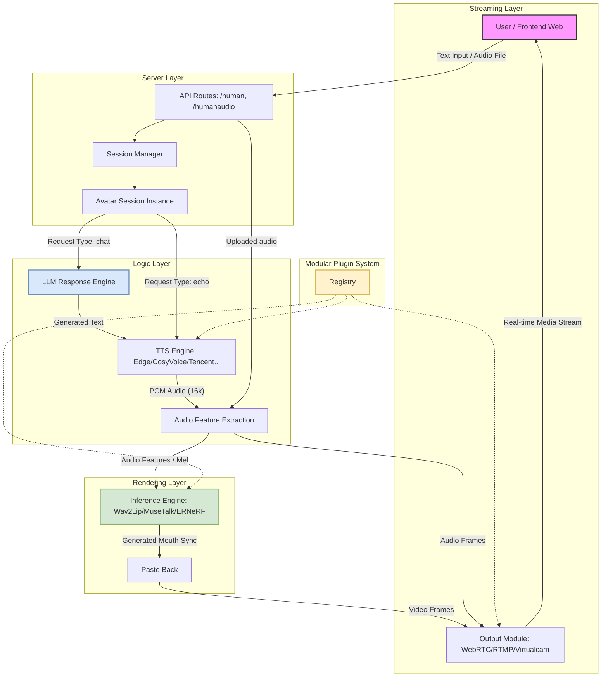

 # [English](./README-EN.md) | 中文版  
 <p align="center">
 
<p align="center">
<p align="center">
    <a href="./LICENSE"></a>
    <a href="https://github.com/lipku/LiveTalking/releases"></a>
    <a href=""></a>
    <a href=""></a>
    <a href="https://github.com/lipku/LiveTalking/graphs/contributors"></a>
    <a href="https://github.com/lipku/LiveTalking/network/members"></a>
    <a href="https://github.com/lipku/LiveTalking/stargazers"></a>
</p>

 实时交互流式数字人，实现音视频同步对话。基本可以达到商用效果  
[wav2lip效果](https://www.bilibili.com/video/BV1scwBeyELA/) | [ernerf效果](https://www.bilibili.com/video/BV1G1421z73r/) | [musetalk效果](https://www.bilibili.com/video/BV1bUwezvEnG/)  
国内镜像地址:<https://gitee.com/lipku/LiveTalking> 

## 为避免与3d数字人混淆，原项目metahuman-stream改名为livetalking，原有链接地址继续可用

## Features
1. 支持多种数字人模型: ernerf、musetalk、wav2lip、Ultralight-Digital-Human
2. 支持声音克隆
3. 支持数字人说话被打断
4. 支持webrtc、rtmp、虚拟摄像头输出
5. 支持动作编排：不说话时播放自定义视频
6. 支持多并发
7. 支持自定义数字人形象

## 1. Installation

Tested on Ubuntu 24.04, Python3.10, Pytorch 2.5.0 and CUDA 12.4

### 1.1 Install dependency

```bash
conda create -n nerfstream python=3.10
conda activate nerfstream
#如果cuda版本不为12.4(运行nvidia-smi确认版本)，根据<https://pytorch.org/get-started/previous-versions/>安装对应版本的pytorch 
conda install pytorch==2.5.0 torchvision==0.20.0 torchaudio==2.5.0 pytorch-cuda=12.4 -c pytorch -c nvidia
pip install -r requirements.txt
``` 
安装常见问题[FAQ](https://livetalking-doc.readthedocs.io/zh-cn/latest/faq.html)  
linux cuda环境搭建可以参考这篇文章 <https://zhuanlan.zhihu.com/p/674972886>  
视频连不上解决方法 <https://mp.weixin.qq.com/s/MVUkxxhV2cgMMHalphr2cg>


## 2. Quick Start
- 下载模型  
夸克云盘<https://pan.quark.cn/s/83a750323ef0>    
GoogleDriver <https://drive.google.com/drive/folders/1FOC_MD6wdogyyX_7V1d4NDIO7P9NlSAJ?usp=sharing>  
将wav2lip256.pth拷到本项目的models下, 重命名为wav2lip.pth;  
将wav2lip256_avatar1.tar.gz解压后整个文件夹拷到本项目的data/avatars下
- 运行  
python app.py --transport webrtc --model wav2lip --avatar_id wav2lip256_avatar1  
<font color=red>服务端需要开放端口 tcp:8010; udp:1-65536 </font>  
客户端可以选用以下两种方式:  
(1)用浏览器打开http://serverip:8010/webrtcapi.html , 先点‘start',播放数字人视频；然后在文本框输入任意文字，提交。数字人播报该段文字  
(2)用客户端方式, 下载地址<https://pan.quark.cn/s/d7192d8ac19b>   

- 快速体验  
[在线镜像](https://www.compshare.cn/images/4458094e-a43d-45fe-9b57-de79253befe4?referral_code=3XW3852OBmnD089hMMrtuU&ytag=GPU_GitHub_livetalking) 用该镜像创建实例即可运行成功

安装运行过程中如果访问不了huggingface，在运行前
```
export HF_ENDPOINT=https://hf-mirror.com
``` 

## 3. Architecture
### 数据流程图
  

### 系统架构图



### 1. API层
- **接口端点**：
    - `/human`：接收文本，用于“（echo）”（直接播放）或“聊天（chat）”（大语言模型交互）场景。
    - `/humanaudio`：接收原始音频文件用于播放。
- **会话管理**：每个连接都会分配一个`sessionid`，用于维护状态并处理多用户并发请求。

### 2. 逻辑层
- **大语言模型（LLM）引擎**：与通义千问（Qwen）等模型对接，生成对话式回复。
- **语音合成（TTS）引擎**：模块化系统，支持多种服务商（EdgeTTS、GPT-SoVITS等），实现文本到语音的转换。
- **语音特征提取**：提取视觉唇形同步所需的声学特征（如梅尔频谱图）。

### 3. 渲染层
- **模型推理**：基于深度学习模型（如Wav2Lip、MuseTalk），根据音频特征生成唇形同步的视频帧。
- **后处理**：将生成的嘴部区域平滑叠加回原始高清虚拟形象视频上。

### 4. 流媒体层
- **传输协议**：
    - **WebRTC**：低延迟的浏览器端流媒体传输协议。
    - **RTMP**：适用于YouTube、哔哩哔哩等平台的标准流媒体协议。
    - **虚拟摄像头**：允许将输出内容作为系统摄像头使用。

### 5. 插件系统
- **注册中心**：采用去中心化的注册机制（[registry.py](./registry.py)），开发者可轻松新增语音合成（TTS）、虚拟形象（Avatar）或输出（Output）模块。 欢迎效果更好的模型和服务接入，也可以进行商业合作。

## 4. More Usage
使用说明: <https://livetalking-doc.readthedocs.io/>
  
## 5. Docker Run  
不需要前面的安装，直接运行。
```
docker run --gpus all -it --network=host --rm registry.cn-beijing.aliyuncs.com/codewithgpu2/lipku-metahuman-stream:2K9qaMBu8v
```
代码在/root/metahuman-stream，先git pull拉一下最新代码，然后执行命令同第2、3步 

提供如下网络镜像
- ucloud镜像: <https://www.compshare.cn/images/4458094e-a43d-45fe-9b57-de79253befe4?referral_code=3XW3852OBmnD089hMMrtuU&ytag=GPU_GitHub_livetalking>  
[ucloud教程](https://livetalking-doc.readthedocs.io/zh-cn/latest/ucloud/ucloud.html) 
- autodl镜像: <https://www.codewithgpu.com/i/lipku/livetalking/base>   
[autodl教程](https://livetalking-doc.readthedocs.io/zh-cn/latest/autodl/README.html)，autodl由于不能开放udp端口，需要部署转发服务，如果看不到视频，请自行部署srs或turn服务


## 6. 性能
- 性能主要跟cpu和gpu相关: 每路视频压缩需要消耗cpu，cpu性能与视频分辨率正相关；每路口型推理跟gpu性能相关。  
- 不说话时的并发数跟cpu相关，同时说话的并发数跟gpu相关。  
- 后端日志inferfps表示显卡推理帧率，finalfps表示最终推流帧率。两者都要在25以上才能实时。如果inferfps在25以上，finalfps达不到25表示cpu性能不足。  
- 实时推理性能  

模型    |显卡型号   |fps
:----   |:---   |:---
wav2lip256 | 3060    | 60
wav2lip256 | 3080Ti  | 120
musetalk   | 3080Ti  | 42
musetalk   | 3090    | 45
musetalk   | 4090    | 72 

wav2lip256显卡3060以上即可，musetalk需要3080Ti以上。 

## 7. 商业版
提供如下扩展功能，适用于对开源项目已经比较熟悉，需要扩展产品功能的用户
1. 高清wav2lip模型
2. 完全语音交互，数字人回答过程中支持通过唤醒词或者按钮打断提问
3. 实时同步字幕，给前端提供数字人每句话播报开始、结束事件
4. 提供实时音频流输入接口
5. 数字人透明背景，叠加动态背景 
6. avatar实时切换  
7. 同一画面里多个数字人互动  
8. 摄像头驱动数字人形象动作和表情  
9. 与livekit对接

更多详情<https://livetalking-doc.readthedocs.io/zh-cn/latest/service.html>

## 8. 声明
基于本项目开发并发布在B站、视频号、抖音等网站上的视频需带上LiveTalking水印和标识。

---  
如果本项目对你有帮助，帮忙点个star。也欢迎感兴趣的朋友一起来完善该项目.
* 知识星球: https://t.zsxq.com/7NMyO 沉淀高质量常见问题、最佳实践经验、问题解答  
* 微信：wxwubug (加群请备注)      
* Telegram: https://t.me/livetalking  
* Discord: https://discord.gg/n5jSPCT3Uf  
* Email: lipku@foxmail.com  
* 微信公众号：数字人技术    


