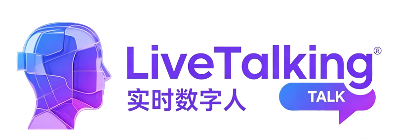
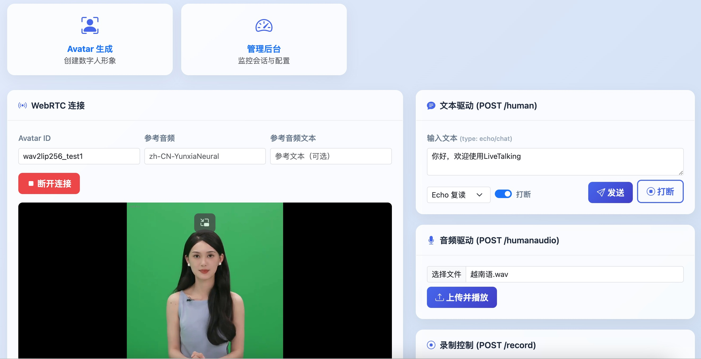

<p align="center">
    
</p>

中文版 ｜ [English](./README-EN.md)


<p align="center">
    <a href="./LICENSE"></a>
    <a href="https://github.com/lipku/LiveTalking/releases"></a>
    <a href=""></a>
    <a href=""></a>
    <a href="https://github.com/lipku/LiveTalking/graphs/contributors"></a>
</p>
<p align="center">
<a href="https://trendshift.io/repositories/12565" target="_blank"></a>
</p>

实时交互流式数字人引擎，实现音视频同步对话，已在业内获得广泛商用

**效果演示**: [wav2lip](https://www.bilibili.com/video/BV1scwBeyELA/) | [ernerf](https://www.bilibili.com/video/BV1G1421z73r/) | [musetalk](https://www.bilibili.com/video/BV1bUwezvEnG/)

国内镜像: <https://gitee.com/lipku/LiveTalking>

---

## Features
1. 支持多种数字人模型: ernerf、musetalk、wav2lip、Ultralight-Digital-Human
2. 支持声音克隆
3. 支持数字人说话被打断
4. 支持全身视频拼接
5. 支持 WebRTC、RTMP、虚拟摄像头输出
6. 支持动作编排：不说话时播放自定义视频
7. 支持多并发
8. 支持自定义数字人形象
9. 提供前端API接口对接

---

## 使用场景

LiveTalking 基于实时流式数字人技术，通过文本或语音驱动虚拟形象说话，结合 LLM 实现智能对话。适用于以下场景：

| 场景 | 说明 |
|------|------|
| **虚拟主播/直播带货** | 24 小时无人直播，通过 LLM 自动生成带货话术，配合动作编排实现自然表现 |
| **AI 数字人客服** | 接入企业知识库，用户语音提问，数字人实时回答，支持打断重说 |
| **在线教育/培训** | 教师数字分身录制课程，或通过 API 驱动数字人讲师实时授课 |
| **智能语音助手** | 结合智能音箱或 APP，调用 `/human` 接口驱动数字人进行语音对话交互 |
| **大屏讲解** | 数字人讲解员在展厅大屏、活动现场等场景进行内容讲解和互动 |
| **短视频批量制作** | 通过 API 批量提交文案生成数字人出镜视频，无需真人拍摄，调用 `/human` + `/record` 接口 |

**核心流程**：用户输入文字/音频 → LLM 生成回复（可选）→ TTS 合成语音 → 数字人实时口型同步 → 音视频推流输出

---

## 1. 安装

已在 Ubuntu 22.04、Python 3.12、PyTorch 2.9.1、CUDA 13.0 测试通过。

### 1.1 安装依赖

```bash
git clone https://github.com/lipku/LiveTalking.git 
conda create -n livetalking python=3.12
conda activate livetalking
# 如果 CUDA 版本不为 13.0 (运行 nvidia-smi 确认)，请根据 PyTorch 官网(https://pytorch.org/get-started/previous-versions)安装对应版本
pip install torch==2.9.1 torchvision==0.24.1 torchaudio==2.9.1 --index-url https://download.pytorch.org/whl/cu130
cd LiveTalking
pip install -r requirements.txt
```

安装常见问题：[FAQ](https://doc.livetalking.ai/docs/faq/)

Linux CUDA 环境搭建参考: <https://zhuanlan.zhihu.com/p/674972886>

---

## 2. 快速开始

### 2.1 下载模型

| 网盘 | 地址 |
|------|------|
| 夸克云盘 | <https://pan.quark.cn/s/83a750323ef0> |
| Google Drive | <https://drive.google.com/drive/folders/1FOC_MD6wdogyyX_7V1d4NDIO7P9NlSAJ?usp=sharing> |

1. 将 `wav2lip256.pth` 拷贝到项目的 `models/` 目录下，重命名为 `wav2lip.pth`
2. 将 `wav2lip256_avatar1.tar.gz` 解压后整个文件夹拷贝到 `data/avatars/` 目录下

### 2.2 启动服务

```bash
python app.py --transport webrtc --model wav2lip --avatar_id wav2lip256_avatar1
```


>  **注意**: 服务端需开放端口 TCP:8010, UDP:1-65536  


### 2.3 客户端接入

| 方式 | 说明 |
|------|------|
| 浏览器 | 打开 `http://serverip:8010/index.html`，点击"开始连接"播放数字人视频，在文本框输入文字提交即可 |
| API 调用 | 参考 [API 文档](docs/api.md) 通过 HTTP 接口驱动 |
| 桌面客户端 | 下载地址: <https://pan.quark.cn/s/d7192d8ac19b> |

### 2.4 Web 页面

| 页面 | 地址 | 说明 |
|------|------|------|
| 首页 | `/index.html` | WebRTC 连接 + 文本/音频驱动 + 录制控制 |
| Avatar 生成 | `/avatar.html` | 上传视频自动生成数字人形象 |
| 管理后台 | `/admin.html` | 实时监控会话状态与全局配置 |



### 2.5 快速体验

使用在线镜像创建实例即可运行:

- [UCloud 镜像](https://www.compshare.cn/images/4458094e-a43d-45fe-9b57-de79253befe4?referral_code=3XW3852OBmnD089hMMrtuU&ytag=GPU_GitHub_livetalking)

### 2.6 使用说明
<https://doc.livetalking.ai>
---

## 3. 系统架构

### 数据流图


### 各层说明

**API 层**
- `/human`: 接收文本，支持 echo（直接复读）和 chat（LLM 对话）模式
- `/humanaudio`: 接收音频文件直接播放
- 每个连接分配唯一 `sessionid`，支持多用户并发

**逻辑层**
- **LLM 引擎**: 对接 Qwen 等大模型生成对话回复
- **TTS 引擎**: 模块化设计，支持 EdgeTTS、GPT-SoVITS、CosyVoice、腾讯云等多种方案
- **特征提取**: 同步提取音频的声学特征（如 Mel 频谱），用于口型推理

**渲染层**
- **模型推理**: 使用深度学习模型 (Wav2Lip, MuseTalk 等) 根据音频特征生成口型画面
- **后处理**: 将生成的口型区域平滑贴回原始高清视频

**推流层**
- **WebRTC**: 低延迟浏览器端推流
- **RTMP**: 标准直播协议，支持推流到 B站/YouTube 等平台
- **虚拟摄像头**: 输出为系统摄像头设备

**插件系统**
- 基于 [registry.py](registry.py) 的去中心化注册机制，开发者可自行扩展 TTS、Avatar、Output 模块

---

## 4. API 接口

| 文档 | 说明 |
|------|------|
| [docs/api.md](docs/api.md) | 通用业务 API — WebRTC、文本/音频驱动、录制、动作编排 |
| [docs/avatar_api.md](docs/avatar_api.md) | Avatar 生成 API — 创建任务、查询进度、删除任务 |
| [docs/admin_api.md](docs/admin_api.md) | Admin 管理 API — 全局配置、会话监控、强制停止 |

---

## 5. Docker 运行

镜像说明:
- **AutoDL**: <https://www.codewithgpu.com/i/lipku/livetalking/base> — [教程](https://doc.livetalking.ai/docs/autodl/)
- **UCloud**: <https://www.compshare.cn/images/4458094e-a43d-45fe-9b57-de79253befe4?referral_code=3XW3852OBmnD089hMMrtuU&ytag=GPU_GitHub_livetalking> — 支持开放任意端口，无需额外部署 SRS — [教程](https://doc.livetalking.ai/docs/ucloud/)

> AutoDL 由于不能开放 UDP 端口，需自行部署 SRS 或 TURN 转发服务。

---

## 6. 性能指标

- 每路视频压缩消耗 CPU，分辨率越高 CPU 消耗越大；每路口型推理消耗 GPU
- 不说话时并发数取决于 CPU，同时说话并发数取决于 GPU
- 后端日志 `inferfps` = GPU 推理帧率, `finalfps` = 最终推流帧率，两者均需 >=25 才算实时

### 实时推理性能

| 模型 | 显卡 | FPS |
|:------|:------|:----|
| wav2lip256 | RTX 3060 | 60 |
| wav2lip256 | RTX 3080Ti | 120 |
| musetalk | RTX 3080Ti | 42 |
| musetalk | RTX 3090 | 45 |
| musetalk | RTX 4090 | 72 |

- wav2lip256 推荐 RTX 3060 及以上
- musetalk 推荐 RTX 3080Ti 及以上

---

## 7. 声明

基于本项目开发并发布在B站、视频号、抖音等平台上的视频需带上 LiveTalking 水印和标识。

---

如果本项目对你有帮助，帮忙点个 Star。也欢迎感兴趣的朋友一起来完善该项目。

| 社区 | 链接 |
|------|------|
| 知识星球 | <https://t.zsxq.com/7NMyO> |
| 微信 | wxwubug (加群请备注) |
| Telegram | <https://t.me/livetalking> |
| Discord | <https://discord.gg/n5jSPCT3Uf> |
| Email | lipku@foxmail.com |
| 微信公众号 | 数字人技术 |


