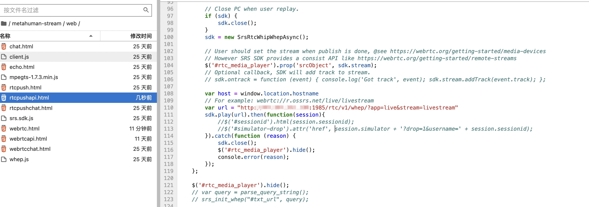
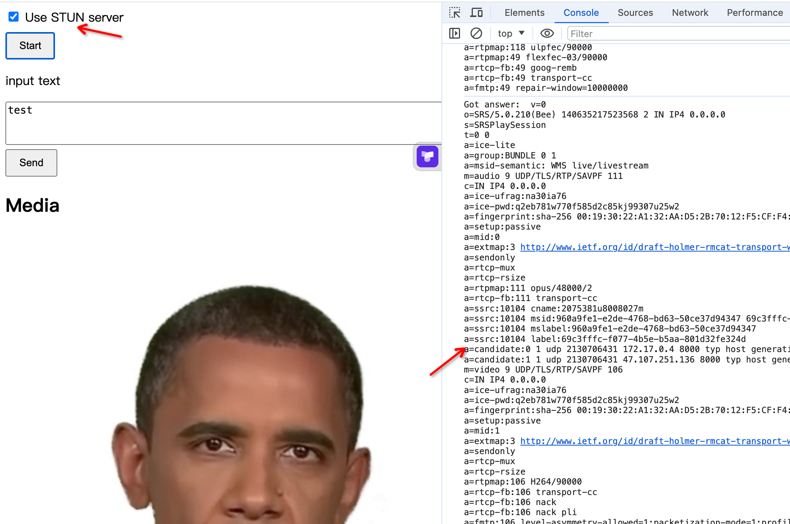

# autodl 使用教程

## autodl 镜像地址
https://www.codewithgpu.com/i/lipku/metahuman-stream/base

## 代码目录
/root/metahuman-stream/

## 依赖安装
```
cd metahuman-stream
git pull
pip install -r requirements.txt
```

## 开始运行
建议直接使用rtcpush 普通webrtc模式存在显示不了的情况
### 在任意公网ip启动 srs服务
```
export CANDIDATE='<服务器外网ip>'
docker run --rm --env CANDIDATE=$CANDIDATE \
  -p 1935:1935 -p 8080:8080 -p 1985:1985 -p 8000:8000/udp \
  registry.cn-hangzhou.aliyuncs.com/ossrs/srs:5 \
  objs/srs -c conf/rtc.conf
```
### 推流到 srs 服务器 
```
python app.py --listenport 6006 --transport rtcpush --push_url 'http://<阿里云服务外网ip>:1985/rtc/v1/whip/?app=live&stream=livestream'
```

### 访问 
访问的是静态的rtcpushapi.html
http://<autodl外网地址>/rtcpushapi.html
你需要修改 项目目录中的  web/rtcpushapi.html

将 
```
var url = "http://"+host+":1985/rtc/v1/whep/?app=live&stream=livestream"
```

替换成 
```
var url = "http://公网ip:1985/rtc/v1/whep/?app=live&stream=livestream"
```

调整如下:


成功则如下图


## 注意事项
1.autodl 如果是个人用户需要使用官方的ssh代理工具进行端口代理，才可以访问6006
2.基础环境镜像中如果想使用musetalk环境，还需要自己操作
3.声音延迟需要后台优化srs的功能
4.musetalk 暂不支持