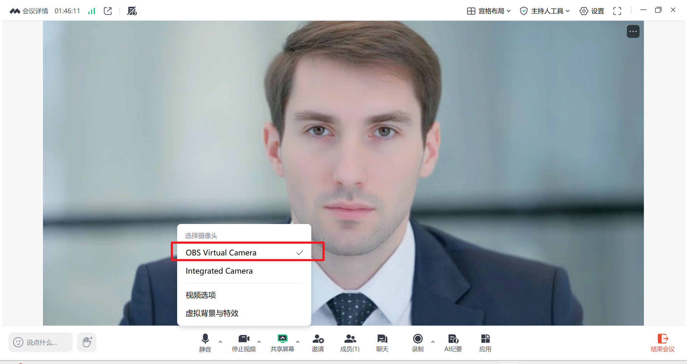

# 虚拟摄像头功能完整指南

## 快速开始

### 1. 启动服务

```bash
python app.py --transport virtualcam --model wav2lip --avatar_id mianshiguan1 --tts doubao --REF_FILE zh_male_yangguangqingnian_emo_v2_mars_bigtts
```

**OBS Studio**: 添加视频捕获设备 → OBS Virtual Camera

需要下载并启动OBS Studio

### 2. 打开控制页面

浏览器访问：**http://localhost:8010/virtualcam.html**

### 3. 控制数字人

- 输入文本，点击"发送文本"让数字人说话
- 点击"打断播放"停止当前说话
- 或使用快捷键：`Ctrl+Enter` 发送，`Escape` 打断

### 4. 在其他应用中使用

- **Zoom/Teams**: 选择摄像头"OBS Virtual Camera"
- 在腾讯会议中按照如下使用新建的虚拟摄像头：



---

## 功能概述

### 主要特性

✅ 后台渲染 - 不依赖浏览器页面
✅ 自动音频设备 - 自动检测系统默认扬声器
✅ 颜色修复 - 自动转换 BGR 到 RGB
✅ Web 控制台 - 完整的 HTTP API 和页面控制
✅ 实时监控 - 说话状态、设备信息实时显示

### 运行模式

| 模式       | 命令                       | 说明                                |
| ---------- | -------------------------- | ----------------------------------- |
| 虚拟摄像头 | `--transport virtualcam` | 后台运行，推流到 OBS Virtual Camera |
| WebRTC     | `--transport webrtc`     | 传统模式，浏览器访问                |

---

## 核心修复说明

### 1. 音频设备自动检测

**问题**: 原代码硬编码 `output_device_index=1`，可能指向麦克风

**修复**: 自动检测系统默认输出设备

```python
# streamout/virtualcam.py
if self.audio_output_device is not None:
    output_device_index = self.audio_output_device
else:
    default_output_info = p.get_default_output_device_info()
    output_device_index = default_output_info['index']
```

### 2. 颜色空间转换

**问题**: OpenCV 使用 BGR，pyvirtualcam 需要 RGB，导致画面偏蓝

**修复**: 自动转换颜色空间

```python
# streamout/virtualcam.py
frame_rgb = cv2.cvtColor(frame, cv2.COLOR_BGR2RGB)
self._cam.send(frame_rgb)
```

---

## 代码修改清单

### 1. config.py - 新增参数

```python
parser.add_argument('--audio_output_device', type=int, default=None,
                    help="音频输出设备索引（None=系统默认）")
```

### 2. app.py - 启动逻辑

```python
if opt.transport == 'virtualcam' or opt.transport == 'rtmp':
    session_manager.add_session('0', build_avatar_session('0', params))
    Thread(target=session_manager.get_session('0').render, args=(thread_quit,)).start()
```

### 3. streamout/virtualcam.py - 核心实现

- 音频设备自动检测
- BGR 到 RGB 颜色转换
- PyAudio 音频播放

### 4. server/routes.py - 新增 API

```python
# 获取虚拟摄像头状态
GET /api/virtualcam/status
```

### 5. web/virtualcam.html - 控制页面

完整的 Web UI 控制台

---

## 使用指南

### OBS Studio 安装和配置

#### OBS 与 pyvirtualcam 的关系

- **OBS Studio**: 提供虚拟摄像头设备驱动
- **pyvirtualcam**: Python 库，向虚拟摄像头推送视频流
- **Zoom/Teams/腾讯会议**: 从虚拟摄像头读取画面

**工作流程**: OBS 创建设备 → pyvirtualcam 推流 → 其他应用读取

#### 安装步骤

1. **下载并安装 OBS Studio**

   - 官网: https://obsproject.com/
2. **首次使用必须启动 OBS Studio 一次**

   - 打开 OBS Studio（首次）
   - 这会激活虚拟摄像头设备
   - 关闭 OBS（设备已注册到系统）
3. **验证虚拟摄像头已注册**

   ```python
   import pyvirtualcam

   try:
       cam = pyvirtualcam.Camera(width=640, height=480, fps=30)
       print(f"成功: {cam.device}")  # 应输出: OBS Virtual Camera
       cam.close()
   except Exception as e:
       print(f"失败: {e}")
   ```

**重要提示**:

- ✅ 首次使用需要启动 OBS 一次
- ✅ 之后无需打开 OBS，设备自动可用
- ✅ 系统重启后设备仍然存在

### 前置要求

```bash
# 安装 OBS Studio 后安装 Python 依赖
pip install pyvirtualcam pyaudio
```

### 基本使用

#### 自动音频设备（推荐）

```bash
python app.py --transport virtualcam --model wav2lip --avatar_id mianshiguan1 --tts doubao --REF_FILE zh_male_yangguangqingnian_emo_v2_mars_bigtts
```

#### 手动指定音频设备

```bash
# 1. 查看音频设备列表
python list_audio_devices.py

# 2. 使用指定设备索引
python app.py --transport virtualcam --audio_output_device 25
```

#### 使用 YAML 配置

```yaml
# config.yaml
transport: virtualcam
model: wav2lip
avatar_id: mianshiguan1
tts: doubao
REF_FILE: zh_male_yangguangqingnian_emo_v2_mars_bigtts
audio_output_device: 25  # 可选
```

```bash
python app.py  # 自动加载 config.yaml
```

---

## 控制页面功能

访问：**http://localhost:8010/virtualcam.html**

### 功能模块

| 模块               | 功能                                        |
| ------------------ | ------------------------------------------- |
| **状态显示** | 实时说话状态、虚拟摄像头信息、音频设备信息  |
| **语音输出** | 文本输入、发送文本、打断播放、快捷短语      |
| **运行配置** | 只读显示当前运行参数（Avatar、TTS、音色等） |
| **历史记录** | 保存最近 20 条发送记录，点击重播            |

### 键盘快捷键

| 快捷键           | 功能     |
| ---------------- | -------- |
| `Ctrl + Enter` | 发送文本 |
| `Escape`       | 打断播放 |

### HTTP API

```bash
# 发送文本
curl -X POST http://localhost:8010/human \
  -H "Content-Type: application/json" \
  -d '{"sessionid":"0","type":"echo","text":"你好"}'

# 打断说话
curl -X POST http://localhost:8010/interrupt_talk \
  -H "Content-Type: application/json" \
  -d '{"sessionid":"0"}'

# 查询状态
curl -X POST http://localhost:8010/is_speaking \
  -H "Content-Type: application/json" \
  -d '{"sessionid":"0"}'

# 获取完整配置
curl http://localhost:8010/api/virtualcam/status
```

---

## 音频设备配置

### 查看设备列表

```bash
python list_audio_devices.py
```

输出示例：

```
[Output Devices]:

Device Index: 5
  Name: 扬声器 (2- Realtek(R) Audio)
  Output Channels: 2

Device Index: 25
  Name: 扬声器 (2- Realtek(R) Audio)
  Host API: Windows WASAPI
```

### 设备选择建议

1. **优先使用 WASAPI 设备**（索引通常 22-27）- 低延迟
2. **DirectSound 设备**（索引通常 15-21）- 兼容性好
3. **留空使用系统默认** - 自动选择，最省心

---

## 常见问题

### Q1: 没有声音

**排查步骤**:

1. 查看启动日志：

   ```
   [VirtualCam Audio] Using default output device: 扬声器 (index 25)
   ```
2. 检查设备索引是否是输出设备：

   ```bash
   python list_audio_devices.py
   ```
3. 手动指定音频设备：

   ```bash
   python app.py --transport virtualcam --audio_output_device 25
   ```
4. 确认 TTS 正常工作（日志有 `doubao tts Time to first chunk`）

### Q2: 画面颜色偏蓝

**已修复**: 代码自动转换 BGR → RGB

### Q3: RuntimeError: virtual camera output could not be started

**原因**: 虚拟摄像头设备未注册或未激活

**解决步骤**:

1. 确认已安装 OBS Studio: https://obsproject.com/
2. **首次使用必须启动 OBS Studio 一次**
   - 打开 OBS Studio
   - 关闭 OBS（设备已激活）
3. 验证设备已注册:
   ```python
   import pyvirtualcam
   cam = pyvirtualcam.Camera(width=640, height=480, fps=30)
   print(cam.device)  # 应输出: OBS Virtual Camera
   ```
4. 之后无需打开 OBS，设备自动可用

### Q4: ModuleNotFoundError: No module named 'pyaudio'

```bash
pip install pyaudio
# 或
pip install pipwin && pipwin install pyaudio
```

### Q5: ModuleNotFoundError: No module named 'pyvirtualcam'

```bash
pip install pyvirtualcam
```

### Q6: 如何确认虚拟摄像头正常工作？

1. 启动日志检查：

   ```
   VirtualCam output started: OBS Virtual Camera with resolution 1280x720
   ```
2. OBS 中验证：

   - 添加"视频捕获设备"
   - 选择"OBS Virtual Camera"
   - 应该能看到数字人画面
3. 发送测试：

   ```bash
   curl -X POST http://localhost:8010/human -H "Content-Type: application/json" -d '{"sessionid":"0","type":"echo","text":"测试"}'
   ```

### Q7: 音频延迟严重

**优化**:

1. 使用 WASAPI 设备（低延迟）
2. 关闭其他音频应用
3. 检查 CPU 占用率

---

## 技术架构

### 渲染流程

```
app.py
  └─> 创建 Session 0
      └─> render() 线程
          └─> inference() 生成帧
              └─> process_frames() 推送帧
                  └─> virtualcam.py
                      ├─> 视频: BGR→RGB → pyvirtualcam
                      └─> 音频: PyAudio → 扬声器
```

### API 接口

| 接口                       | 方法 | 功能         |
| -------------------------- | ---- | ------------ |
| `/human`                 | POST | 发送文本     |
| `/interrupt_talk`        | POST | 打断说话     |
| `/is_speaking`           | POST | 查询说话状态 |
| `/api/virtualcam/status` | GET  | 获取完整状态 |

### 关键文件

| 文件                        | 作用             |
| --------------------------- | ---------------- |
| `config.py`               | 命令行参数定义   |
| `app.py`                  | 启动逻辑         |
| `base_avatar.py`          | 渲染线程         |
| `streamout/virtualcam.py` | 虚拟摄像头输出   |
| `web/virtualcam.html`     | Web 控制页面     |
| `list_audio_devices.py`   | 音频设备查询工具 |

---

## 总结

虚拟摄像头功能现已完整实现，支持：

✅ **核心功能** - 自动音频检测、颜色修复、后台渲染
✅ **易用性** - Web 控制台、HTTP API、交互式操作
✅ **稳定性** - 独立线程、异常处理、资源管理

现在可以轻松将数字人推流到 Zoom、Teams、OBS 等应用！
